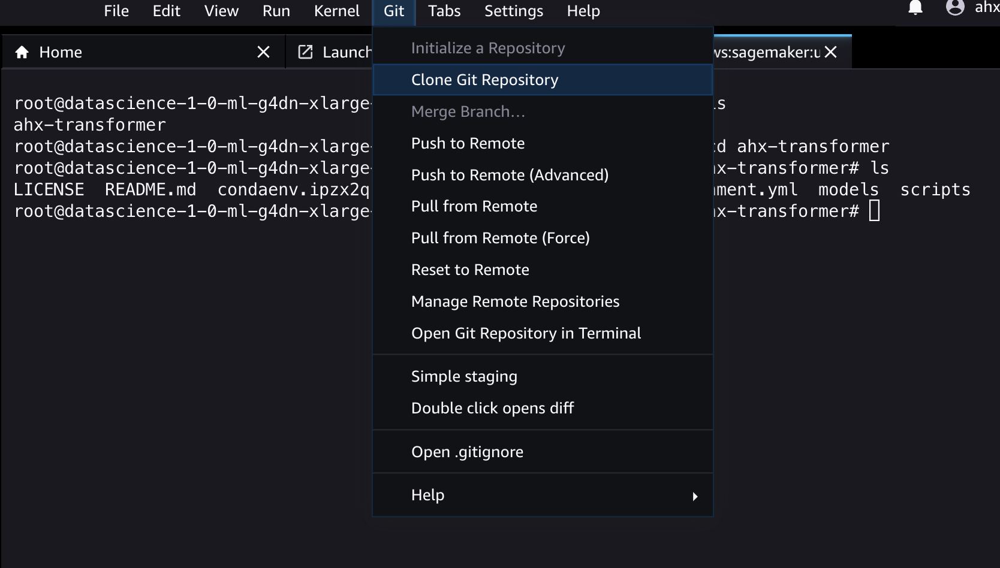

# ahx-transformer: Train Transformer Models to Rewrite Strings

The python scripts in this repo train transformer models as presented by 
[Andrej Karpathy](https://www.youtube.com/watch?v=kCc8FmEb1nY). 
These transformers use decoders only, just like GPT. 
The scripts can run locally on your own machine, or you can use them on AWS Sagemaker.
Calling any script without options will print a usage message with examples.

The point is that no precanned transformer implementation is used. All details are visible in 
transformer.py. You can make changes there to find out why things are done the way 
they are done.

## Rewriting Strings

A simple example for a rewriting rule would be to replace any occurrence of the letter A by two letters A. 
For example,

```
ABA -> AABAA
```

We can generate any amount of training data for any rule we like and then check what 
hyperparameters, training data, training time a transformer needs to learn that rule. 
Currently, there are just two toy examples to help put the scaffolding into place. 
See if you can generalize this thing until it learns to be a Turing Machine! 

## Python Environment

```
$ cd ahx-transformer
$ conda env create -f environment.yml
$ conda activate ahx-transformer
```

## Generate Training Data

Currently, two rewriting rules are implemented in `gen_data.py`:

- copy: The output is the input
- double_a: The output is the input, with all letters A doubled

Feel free to change the script to generate whatever you are interested in.
The rest of the toolchain is agostic to the particular problem, except for the test cases
in `train.py`. You would have to add new test cases to `train.py` after you add your own rules.
Otherwise, you just see the loss values.

Usage:
```
$ python gen_data.py [--problem copy|double_a] 
    [--num_samples <int>] [--max_len <int>] outfile
```

Output goes to `<outfile>_train.txt` and `<outfile>_val.txt`.
Ten percent of the samples will be used for validation.
The `max_len` parameter limits the length of the input strings.

## Training a Model

The script `train.py` takes hyperparameters and the training data files as input and trains a model. 
If a GPU is found, it will automatically be used. There is currently no parallelization to more than one 
GPU/process/thread/machine. 

Usage:
```
$ python train.py [--problem copy|double_a] 
    [--block_sz <int>] [--embed_sz <int>] [--batch_sz <int>] [--num_layers <int>] 
    [--num_heads <int>] [--dropout <float>] [--learning_rate <float>] 
    [--eval_interval <int>] [--num_epochs <int>]  [--min_loss <int>] 
    [--model_in <file_path>] [--model_out <file_path>] --infile <str>
```

The parameter `block_sz` is known as context size in GPT. Training will abort after `num_epochs` or when validation loss falls below 
`min_loss`. A model checkpoint is saved every `eval_interval` epochs. You can start training from an existing model by using `--model_in`. 
The final model will be written to `--model_out`. All paths can be local or S3 URLs.

The value of `--embed_sz` is crucial. It affects the embeddings and all layers. The value should be larger than 32 for acceptable results.
Larger values of `--batch_sz` do not necessarily speed up convergence, but they do help in making better use of a GPU. On a CPU,
32 is a good value.

Good values for `--learning_rate` are in the range of 3E-4 to 3E-3 .

To test whether things work at all, try

```
$ cd ahx-transformer/scripts
$ python train.py --problem copy --block_sz 32 --embed_sz 32 --batch_sz 32 --num_layers 1 --num_heads 2 --num_epochs 10 --learning_rate 3e-3 --infile samples_cp_small --model_out mymodel.pt
```

Training and validation data are read into memory from `<infile>_train.txt` and `<infile_val>.txt`. If your data is too large
to fit into memory, you will have to add some smarter behavior to the `get_batch()` function.

## Evaluating a Model

During training, you only see the loss, and potentially the test cases. Eventually, you probably
want to see accuracy and examples of failures.

This can be done with 

```
$ python eval.py --model_file mymodel.pt --data_file ../data/samples_cp_small_val.txt
```

## Using a Model Interactively

You can type prompts directly into a model with

```
$ python interactive.py --model_file mymodel.pt
```

The model path can be an S3 URL.

## Running on AWS Sagemaker

AWS Sagemaker is an Amazon cloud service that lets you run training jobs on hardware of your choice. 
You can choose whether you just want a CPU, or one or more GPUs. The machine will be set up on demand,
and disappear when you are done. Billing is by the second and starts at around 50 cents an hour 
for a machine with a GPU. The overhead for machine setup is about 5 minutes.

### Setting up Sagemaker

This is the usual annoying configuration dance. Below are the steps, with no guarantee of completeness.
And of course, all of this stuff tends to change without notice, so expect some hiccups.

Log into the AWS console and go to Sagemaker [setup](https://us-east-2.console.aws.amazon.com/sagemaker/home?region=us-east-2#/getting-started).
You have to create a *role* and a *domain*, and you will specify an S3 bucket Sagemaker will use. 
The role determines all rights and is identified by an `ARN` you need to remember. It looks something
like `arn:aws:iam::147785435127:role/service-role/my-sagemaker-role` .
If you want to access and edit the role later, you have to go through 
AWS [IAM](https://us-east-1.console.aws.amazon.com/iamv2/home?region=us-east-2#/roles).
Permission policies are attached to the role. You need CloudWatchFullAccess and AmazonSagemakerFullAccess.
There is a limit of ten permissions per role, so you might have to delete some rights you don't need 
before adding the important ones. Your screen should look like this:


You must give Sagemaker the right to assume the role, without conditions. Navigate to Trust Relationships
while editing the role, and add this piece of json:


You can edit the domain from the Sagemaker [home screen](https://us-east-2.console.aws.amazon.com/sagemaker/home).
You have to add a user, and make sure the user can assume the role you made earlier. The screen is shown below. Notice
the ARN of the execution role.


### How to Run a Job on Sagemaker

There are two ways to run on Sagemaker:

- From a local python script (sagemaker_train.py)
- Via a browser and Sagemaker Studio (*not* Studio Lab)

Running `sagemaker.py` has the advantage that you do not have to log into a browser interface,
and the remote machine will automatically be shut down when training is done, avoiding unexpected cost.
Logs (all print statements) are visible locally, but are also collected by AWS Cloudwatch, 
so you never lose the logs. If you terminate the local process, training will still run to completion
on Sagemaker.

Running from Sagemaker Studio gives you a terminal into the training machine, and you can run 
`train.py` there. You might even be able to get things to run in a Jupyter notebook. The downside
is that you are responsible for shutting things down if you don't want billing to continue.
The main use of Sagemaker Studio is to test out whether you correctly copy all data to the GPU, 
which is sometimes a problem. Debugging GPU parallelism is probably also best done in Sagemaker studio.

However, if you want to run several jobs at the same time, to test various hyperparameters,
using `sagemaker.py` is more convenient.


### Running with Sagemaker Studio

If go to the Sagemaker home page, you should be able to choose your user at the top right and open Studio:


Then, click on Open Launcher and then Image Terminal. It takes a few minutes for the VM to boot.
There is a git menu at the top that lets you clone the repository:



The Conda environment installation and all scripts should work just like on your local machine and you're good to go.
Remember to quit Studio with File -> Shutdown -> Shutdown All .

### Running with sagemaker_train.py

The script `sagemaker.py` does not take parameters as it is basically just a configuration file. 

The important variables are:

- `aws_role`: The ARN of your Sagemaker role.
- `hyperparameters`: What command line args to pass to the train script. 
- `output_path`: Your results will go to this S3 path.
- The `train` key in `fit_parms` specifies the S3 folder for the training data. 
  Sagemaker will look for the `infile` specified further up in this folder. 

If you get a ResourceLimitExceeded error, you can increase the quota 
[here](https://us-east-2.console.aws.amazon.com/servicequotas/). 

You have to run `sagemaker_train.py` from one level above:

```
$ cd ahx-transformer
$ python scripts/sagemaker.py
```

If your role has sufficient CloudWatch rights, logs will tail to your local screen and also go to AWS CloudWatch.
Otherwise, your ouput will just silently disappear.
If you are sure your role has the rights, and you still see no logs in CloudWatch, you probably have it set to the wrong region.
Here's a screenshot where to set the region:


Good Luck!


